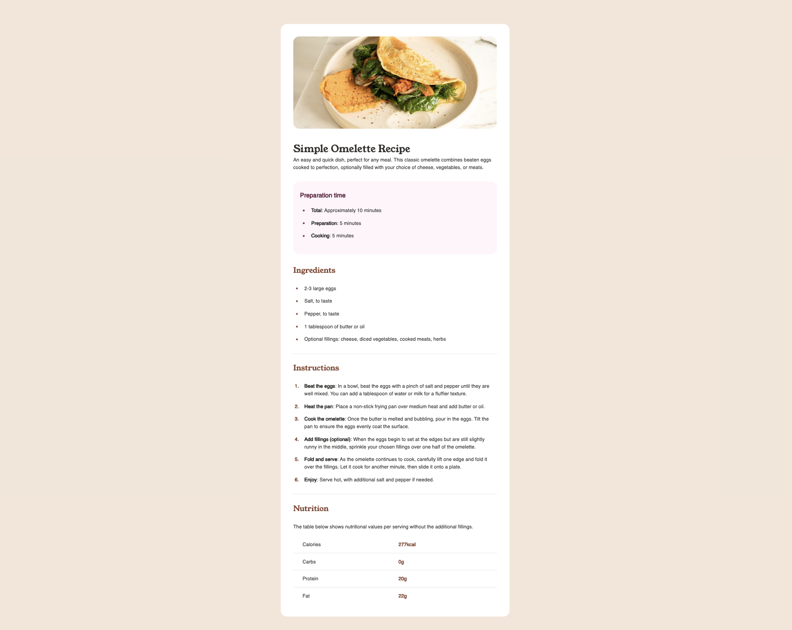
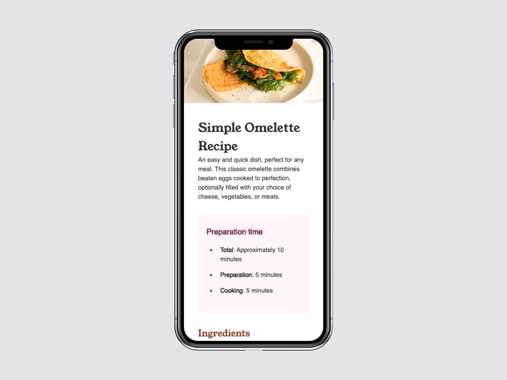

# Frontend Mentor - Recipe page solution

This is a solution to the [Recipe page challenge on Frontend Mentor](https://www.frontendmentor.io/challenges/recipe-page-KiTsR8QQKm). Frontend Mentor challenges help you improve your coding skills by building realistic projects. 

## Table of contents

- [Overview](#overview)
  - [The challenge](#the-challenge)
  - [Screenshot](#screenshot)
  - [Links](#links)
- [My process](#my-process)
  - [Built with](#built-with)
  - [What I learned](#what-i-learned)
- [Author](#author)

## Overview

### The challenge

To build a Recipe page.

### Screenshot

### Links

- Solution URL: [GitHub](https://github.com/svetikbaihe/recipe-page-main.io.git)
- Live Site URL: [github-pages](https://svetikbaihe.github.io/recipe-page-main.io/)

## My process

### Built with

- Semantic HTML5 markup
- CSS

### What I learned

Just another one of my very first projects. Simple semantic HTML and CSS.

## Author

- Frontend Mentor -
  [@svetikbaihe](https://www.frontendmentor.io/profile/svetikbaihe)
